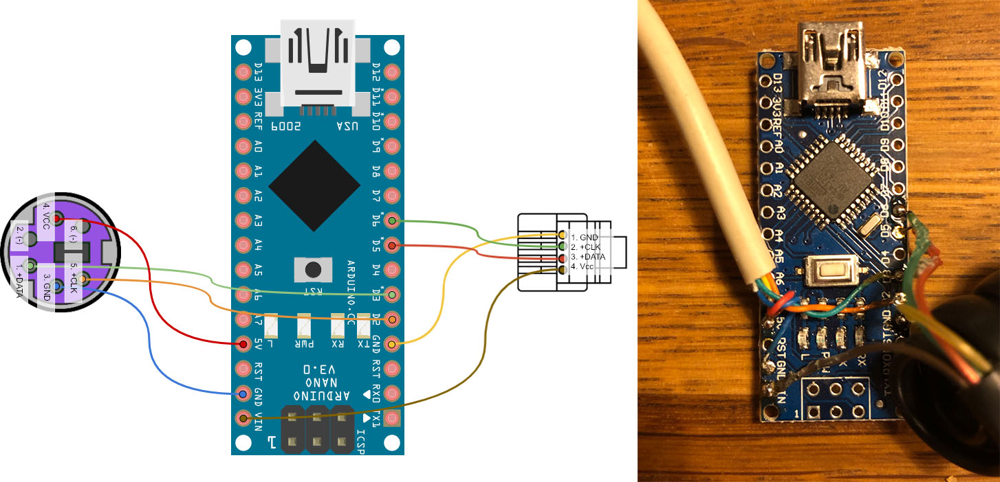

# Arduino-based PS2 -> Macintosh Plus keyboard adapter

This sketch allows to use a PS/2 keyboard with the Macintosh Plus. Mapping between PS/2 keys and Mac keys is stored in the [keymap.ino](mac_plus_ps2/keymap.ino) file. Sketch uses a modified version of the [PS2Keyboard Library](http://www.pjrc.com/teensy/td_libs_PS2Keyboard.html) --- all the logic except `getScanCode()` method have been stripped.

#### Connecting to Macintosh Plus

Get a phone cord with RJ10 plug and connect pin as follows:

1. Vcc -> Vin
2. +DATA -> pin D5,
3. +CLK -> pin D6,
4. GND -> GND.

#### Connecting to PS/2 keyboard

For the Mini-DIN 6 socket, pins should be connected as follows:

1. +DATA -> pin D3,
2. (not connected),
3. GND -> GND,
4. Vcc -> +5V,
5. +CLK -> pin D2,
6. (not connected)

## References
 
* [Similar project based on stm32f0discovery kit](https://web.archive.org/web/20190414143235/http://www.synack.net/~bbraun/mackbd/index.html),
* [Mac Hardware Info] (ftp://ftp.apple.asimov.net/pub/apple_II/documentation/macintosh/Mac%20Hardware%20Info%20-%20Mac%20128K.pdf) - contains the description of the protocol,
* [Mac Plus keyboard rawcodes](https://github.com/altercation/tmk_firrmware_hhkb_teensy2/blob/master/protocol/m0110.c).
