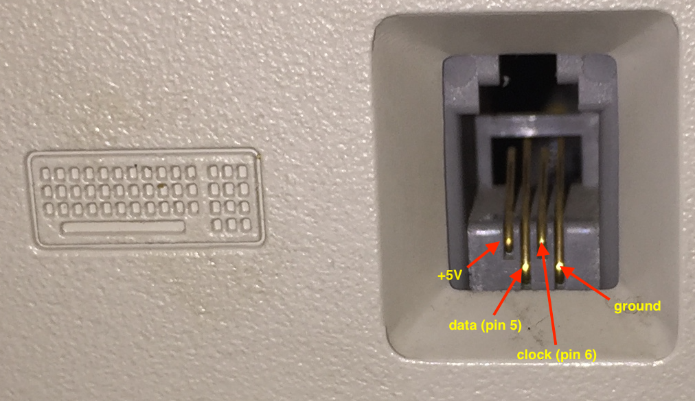

# Arduino-based PS2 -> Macintosh Plus keyboard adapter

This sketch allows to use a PS/2 keyboard with the Macintosh Plus. Mapping between PS/2 keys and Mac keys is stored in the [keymap.ino](keymap.ino) file. Sketch uses a modified version of the [PS2Keyboard Library](http://www.pjrc.com/teensy/td_libs_PS2Keyboard.html) --- all the logic except `getScanCode()` method have been stripped.

## Connecting to Macintosh Plus

Get a phone cord with RJ10 plug and connect pin as follows:

1. +5V,
2. pin 5,
3. pin 6,
4. GND.

The order of RJ10 pins is the same as in the computer connector:

## Connecting to PS/2 keyboard

For the Mini-DIN 6 plug, pins should be connected as follows:

1. pin 2,
2. -,
3. GND,
4. +5V,
5. pin 6,
6. -
